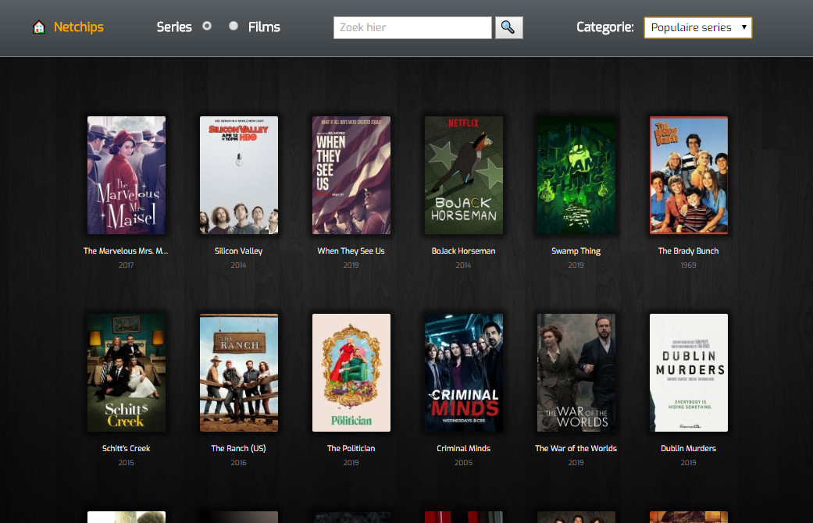

# Netchips

Netchips is a cross-platform application that lets you watch your favorite movies and series. You can select the films and TV shows you want to watch in the future and it will notify you when a new episode is available.

Netchips is built using [Electron](https://electronjs.org/). It scrapes various websites for relevant metadata and video content. The application updates automatically when a new update is available.

## Dependency

In order to watch some of the movies, Flash Player functionality is required. The [Pepper Flash plugin](https://electronjs.org/docs/tutorial/using-pepper-flash-plugin) must be included in the root directory.

## Note

This project is no longer maintained. It worked awesomely between 2014 and 2018.

## Screenshot

